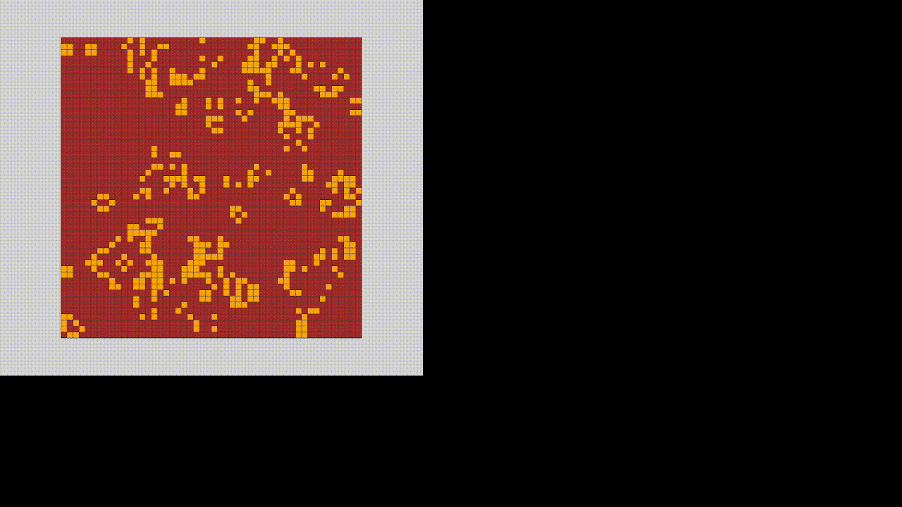
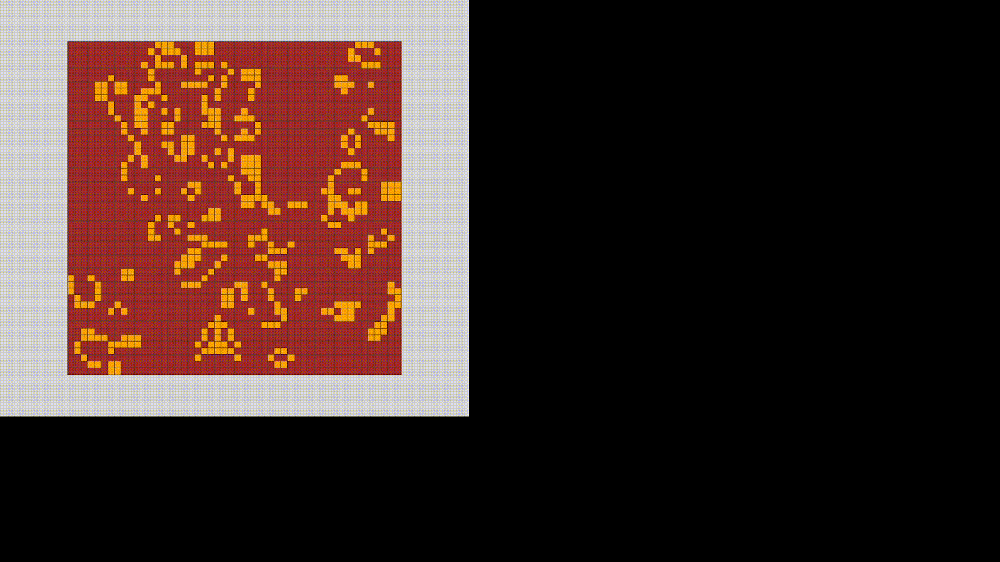

# Game of Life Rust raylib

## Demo





## Build

```bash
$ cargo build --release
```

## Run

```bash
$ cargo run --bin game_of_life
```

## Control

- Q or Esc
    - quit program
- S
    - pause & restart
- click cell
    - activate this cell
